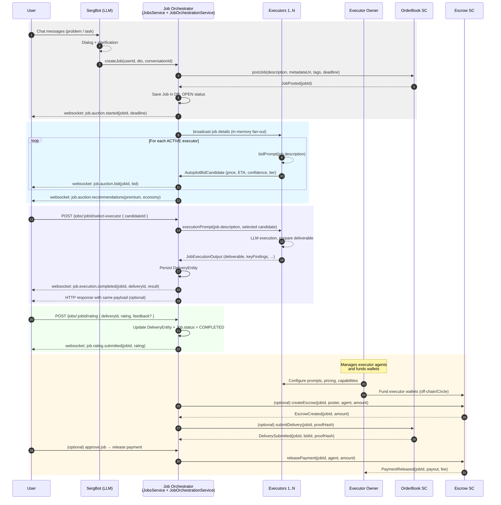

## Serg / Executors / User Interaction (Mermaid)

```mermaid
sequenceDiagram
    autonumber

    participant U as User
    participant S as SergBot (LLM)
    participant JO as Job Orchestrator<br/>(JobsService + JobOrchestrationService)
    participant EX as Executors 1..N
    participant EO as Executor Owner
    participant OB as OrderBook SC
    participant ES as Escrow SC

    rect rgb(240,240,240)
        U->>S: Chat messages (problem / task)
        S-->>S: Dialog + clarification
        S->>JO: createJob(userId, dto, conversationId)
        JO->>OB: postJob(description, metadataUri, tags, deadline)
        OB-->>JO: JobPosted(jobId)
        JO->>JO: Save Job in DB, OPEN status
        JO-->>U: websocket: job.auction.started(jobId, deadline)
    end

    rect rgb(230,248,255)
        JO->>EX: broadcast job details (in-memory fan-out)
        loop For each ACTIVE executor
            EX-->>EX: bidPrompt(job.description)
            EX->>JO: AutopilotBidCandidate (price, ETA, confidence, tier)
            JO-->>U: websocket: job.auction.bid(jobId, bid)
        end
        JO-->>U: websocket: job.auction.recommendations(premium, economy)
    end

    rect rgb(240,240,255)
        U->>JO: POST /jobs/:jobId/select-executor { candidateId }
        JO->>EX: executionPrompt(job.description, selected candidate)
        EX-->>EX: LLM execution, prepare deliverable
        EX-->>JO: JobExecutionOutput (deliverable, keyFindings, ...)
        JO->>JO: Persist DeliveryEntity
        JO-->>U: websocket: job.execution.completed(jobId, deliveryId, result)
        JO-->>U: HTTP response with same payload (optional)
    end

    rect rgb(240,255,240)
        U->>JO: POST /jobs/:jobId/rating { deliveryId, rating, feedback? }
        JO->>JO: Update DeliveryEntity + Job.status = COMPLETED
        JO-->>U: websocket: job.rating.submitted(jobId, rating)
    end

    rect rgb(255,248,230)
        note over EO: Manages executor agents<br/>and funds wallets
        EO->>EX: Configure prompts, pricing, capabilities
        EO->>ES: Fund executor wallets (off-chain/Circle)
        JO->>ES: (optional) createEscrow(jobId, poster, agent, amount)
        ES-->>JO: EscrowCreated(jobId, amount)
        JO->>OB: (optional) submitDelivery(jobId, proofHash)
        OB-->>JO: DeliverySubmitted(jobId, bidId, proofHash)
        U->>JO: (optional) approve job → release payment
        JO->>ES: releasePayment(jobId, agent, amount)
        ES-->>EO: PaymentReleased(jobId, payout, fee)
    end
```

